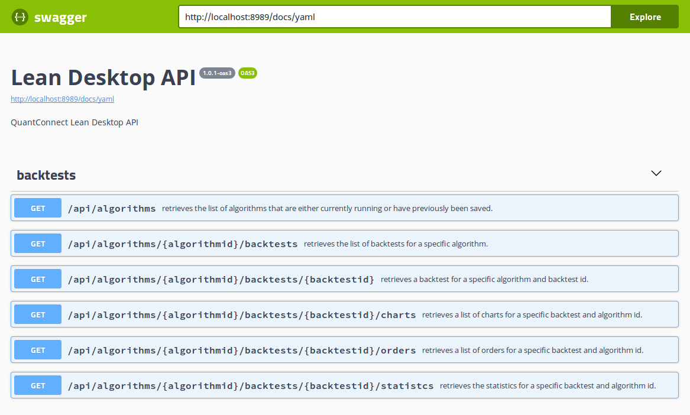

** Desktop Server Prototype Overview**

# Purpose

To discover how a Desktop API for the LEAN codebase could potentially look.

## Affected Code Areas

* DesktopServer (New Project)
* Launcher (Stopped automatically launching a desktop app as the desktop server can now live through many Launcher runs)
* Messaging (Added DesktopMessageHandler)
* Queues (Added Backtest name generator e.g. Daring Yellow Pigeon, used in AlgorithmId, I needed a unique name per backtest)

## Desktop Server Architecture Overview

## REST API ##

The Desktop REST API design can be viewed on [SwaggerHub - Lean Desktop API](https://app.swaggerhub.com/apis/eugeneduvenage/LeanDesktopAPI/1.0.1-oas3), or when the DesktopServer.exe is launched the documentation can be viewed locally at **http://localhost:8989/docs**. The local documentation site allows interactive testing of the API.

A local copy exists in the DesktopServer project in the webserver folder as swagger.yaml, it can be viewed with a local swagger viewer such as the swagger plugin for Visual Studio Code at design time.

There are currently six REST endpoints that cover the basics of a backtest result API **ONLY**. Live algorithms would need a superset of this API.

## Running the Desktop server ##

Be sure to launch the desktop server project before running the launcher.
The user home folder code has only been tested on Linux but has written to be cross platform, it should just work on other platforms.

Leave the desktop server app running and launch as many algorithm runs as you wish. Each run should be persisted to $HOME/Lean/{algorithmClassTypeName}/backtests/{three-part-backtest-id}. If you make changes to the DesktopServer, make sure to do a full build, I got Composer failures when I did not.

## Things to consider ##

**This code is exploratory**, its not intended as a PR at this point. The intention was to discover how a useful API could be delivered within the current LEAN codebase, i.e. with a Launcher that runs a single algorithm at a time.

There is a good chance some of the REST models are not accurate, this first attempt was to cleanly extract API models that reflect the needs of an end user API rather than just exposing the operational classes.

## Limitations ##

Only tested with Forex, some of other security types may have incomplete symbol models.